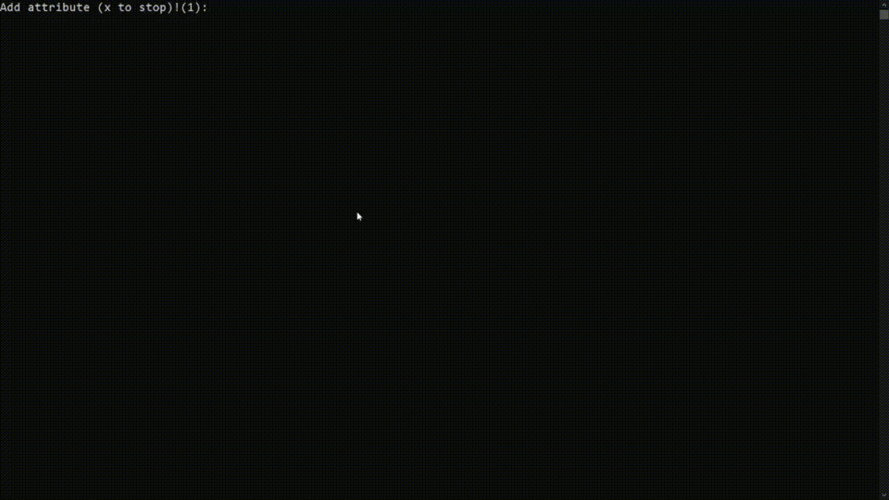

# Closure Calculator Project - Relational Algebra (C Language)
 

Welcome to the **Closure Calculator** project implemented in C language! This console application allows users to calculate the closure of attributes for a given set of functional dependencies. Whether you're studying databases or looking to understand the concept of attribute closure, this project provides an interactive platform to experiment and learn.

## Table of Contents

- [Closure Calculator Project - Relational Algebra (C Language)](#closure-calculator-project---relational-algebra-c-language)
  - [Table of Contents](#table-of-contents)
  - [Features](#features)
  - [Installation](#installation)
  - [Usage](#usage)
  - [Contributing](#contributing)

## Features

- Calculate the closure of attributes for a given set of functional dependencies.
- Interact with the program using a command-line interface.
- Understand the principles of attribute closure through hands-on experience.

## Installation

1. Clone this repository to your local machine using:
   `git clone https://github.com/YourUsername/closure-calculator-c`
2. Navigate to the project directory:
    `cd closure-calculator-c`
3. Compile the C code using a C compiler (e.g., GCC):
    `gcc closure.c -o closure`

## Usage

1. When you launch the application, you'll be prompted with a command-line interface to input your functional dependencies.

2. Enter the functional dependencies as instructed by the program.

3. The program will calculate and display the closure of attributes.

## Contributing

We welcome contributions to enhance this C implementation of the project! If you have ideas for improvements or identify any issues, please submit a pull request or create an issue in the repository.

1. Fork the repository to your GitHub account.

2. Clone the repository to your local machine.

3. Create a new branch with a descriptive name:

4. Implement your changes and additions in the C code.

5. Compile and test your code to ensure it works as expected.

6. Commit and push your changes to your forked repository.

7. Create a pull request explaining the purpose and details of your changes.

---

Enjoy exploring attribute closure using the C language! If you have questions or need assistance, feel free to reach out to us at your@email.com.
